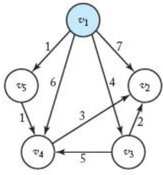

# 알고리즘 2분반 과제3

32204913 허준서

알고리즘 2분반 과제3      
  
    
     
      
       
# 자료구조

```python
class Tree:
    def __init__(self, node_count: int, edge_list: 'list[Edge]'):
        self.node_count = node_count
        self.edge_list = edge_list

class Edge:
    def __init__(self, start: int, end: int, cost: int):
        self.start = start
        self.end = end
        self.cost = cost

    def __str__(self):
        return f'({self.start} to {self.end}, cost: {self.cost})'
```

트리 자료구조는 노드의 개수와 엣지의 리스트를 갖는다.

엣지는 출발 노드(start), 도착 노드(end), 비용(cost)를 갖는다.



따라서 위와 같은 트리는 아래 코드와 같이 나타낼 수 있다.

```python
# initialize tree
node_count = 5
edge_list = [Edge(start=1, end=2, cost=7),
             Edge(start=1, end=3, cost=4),
             Edge(start=1, end=4, cost=6),
             Edge(start=1, end=5, cost=1), 
             Edge(start=3, end=2, cost=2), 
             Edge(start=3, end=4, cost=5), 
             Edge(start=4, end=2, cost=3), 
             Edge(start=5, end=4, cost=1)]
tree = Tree(node_count=node_count, edge_list=edge_list)
```

혹은 더 간단히 아래와 같이 나타낼 수 있다.

```python
# initialize tree
node_count = 5
edge_list = [(1, 2, 7), (1, 3, 4), (1, 4, 6), (1, 5, 1), (3, 2, 2), (3, 4, 5), (4, 2, 3), (5, 4, 1)]
tree = Tree(node_count=node_count, edge_list=[Edge(*edge) for edge in edge_list])
```
  

# 구현

다익스트라 함수 코드는 아래와 같다.

파라미터로 탐색의 대상인 Tree와 탐색을 시작하는 기준이 되는 start_node를 받는다.

```python
def dijkstra(tree: Tree, start_node: int = 1):
    visited: list[int] = [start_node]
    costs: dict[int, int] = {start_node: 0}

    while len(visited) != tree.node_count:
        edge, cost = min([(edge, edge.cost + costs[edge.start]) for edge in tree.edge_list if edge.start in visited and edge.end not in visited], key=lambda x: x[1])
        visited.append(edge.end)
        costs[edge.end] = cost
```

- visited: 방문한 노드들이 기록되는 리스트이며, start_node는 이미 방문한 상태와 다름이 없기 때문에 초기값은 [ start_node ]
- costs: start_node에서 특정 노드까지의 비용의 최솟값이 저장되는 딕셔너리(해시테이블)이며, 시작 노드에서 시작 노드로 가는 비용은 0 이므로 초기값은 { start_node: 0 }

edge를 선택할 때, 이미 방문한 노드를 도착점으로 삼고 있는 엣지는 고려 대상이 아니다. 또한 엣지의 출발점이 이미 방문한 노드가 아닌 경우도 고려 대상이 아니다. 따라서 `(edge.start in visitied) and (edge.end not in visited)` 인 edge만이 고려대상이 된다.


예를 들어 위와 같은 상태의 트리에서, 엣지를 선택하기 위해 모든 엣지를 고려하는 게 아니라, 1번 노드에서 출발하는 4개의 엣지만을 고려하면 충분하다.

또한 start_node에서 edge.end 까지 가는 비용은 (start_node에서 edge.start로 가는 비용) + (edge.start에서 edge.end로 가는 비용) 이며, (edge.start에서 edge.end로 가는 비용)은 edge.cost와 같고, (start_node에서 edge.start로 가는 비용)은 위에서 정의한 대로 costs[edge.start]와 같다.

따라서 `(start_node에서 edge.end로 가는 비용) = edge.cost + costs[edge.start]` 이다.

즉 `(edge.start in visitied) and (edge.end not in visited)` 인 엣지들에 대해 `edge.cost + costs[edge.start]` 가 최소인 엣지를 선택하면 된다. 이를 코드로 나타내면 다음과 같다.

```python
min([(edge, edge.cost + costs[edge.start]) for edge in tree.edge_list if edge.start in visited and edge.end not in visited], key=lambda x: x[1])
```

위에서 얻은 엣지와 총 비용 edge, cost에 대해, visited 리스트에 edge.end를 추가하고 costs[edge.end] = cost로 설정한다.

```python
visited.append(edge.end)
costs[edge.end] = cost
```

  
# 결과

## 결과1


위와 같은 트리에 대해 프로그램의 코드와 실행 결과는 다음과 같다.

```python
node_count = 5
edge_list = [(1, 2, 7), (1, 3, 4), (1, 4, 6), (1, 5, 1), (3, 2, 2), (3, 4, 5), (4, 2, 3), (5, 4, 1)]
tree1 = Tree(node_count=node_count, edge_list=[Edge(*edge) for edge in edge_list])

dijkstra(tree1)
```


- candidates는 고려대상이 되는 edge들의 리스트
- selected edge는 해당 단계에서 선택된 edge
- visited는 해당 단계가 끝난 뒤 방문한 노드들의 리스트
- costs는 start_node에서 해당 노드까지의 최소비용 { 노드번호: 비용 }
  

## 결과2

](imgs/Untitled%203.png)

[https://namu.wiki/w/다익스트라 알고리즘](https://namu.wiki/w/%EB%8B%A4%EC%9D%B5%EC%8A%A4%ED%8A%B8%EB%9D%BC%20%EC%95%8C%EA%B3%A0%EB%A6%AC%EC%A6%98)

```python
node_count = 6
edge_list = [(1, 2, 10), (1, 3, 30), (1, 4, 15), (2, 5, 20), (3, 6, 5), (4, 3, 5), (4, 6, 20), (5, 6, 20), (6, 4, 20)]
tree2 = Tree(node_count=node_count, edge_list=[Edge(*edge) for edge in edge_list])

dijkstra(tree2)
```


  

## 결과3

](imgs/Untitled%205.png)

[https://hsp1116.tistory.com/42](https://hsp1116.tistory.com/42)

```python
node_count = 5
edge_list = [(1, 4, 3), (1, 3, 6), (2, 1, 3), (3, 4, 2), (4, 3, 1), (4, 2, 1), (5, 2, 4), (5, 4, 2)]
tree3 = Tree(node_count=node_count, edge_list=[Edge(*edge) for edge in edge_list])

# 시작 노드가 5번 노드이다.
dijkstra(tree3, start_node=5)
```


